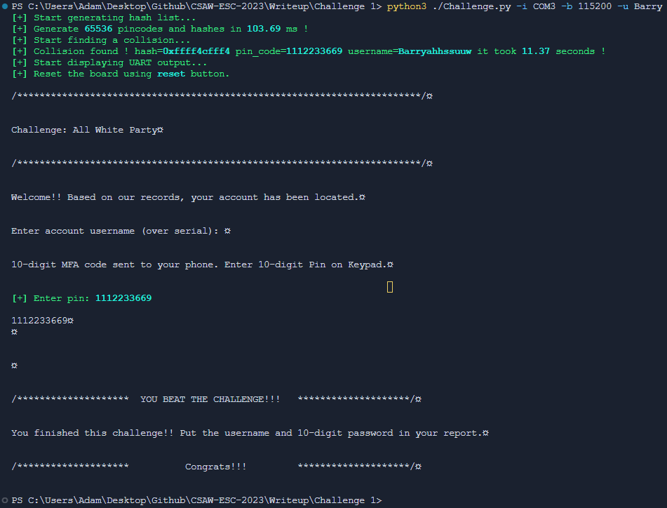
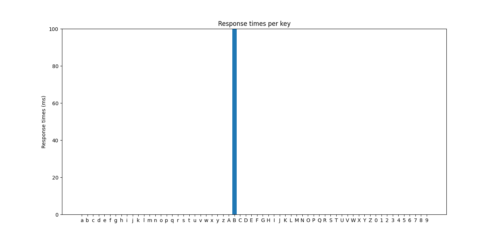
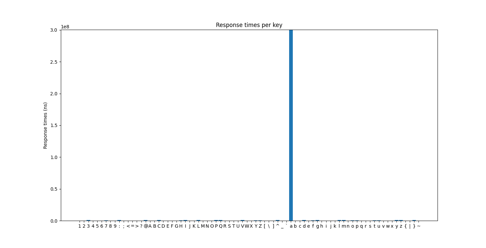
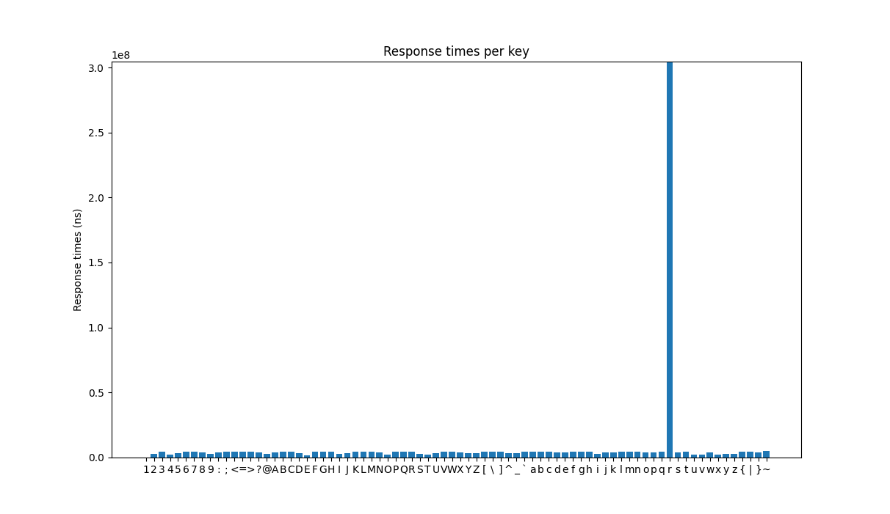
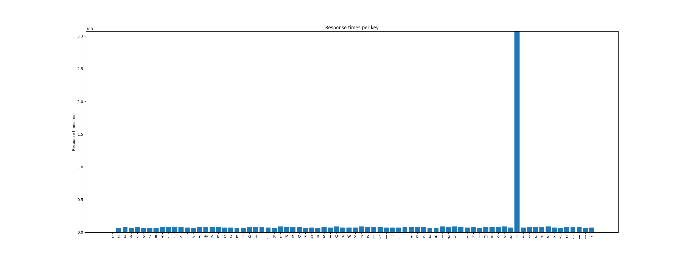

# All White Party Challenge Solution Script

```console
usage: Challenge.py [-h] -i INTERFACE -b BAUDRATE [-d] [-u USERNAME]

All White Party challenge solution script.

options:
  -h, --help            show this help message and exit
  -i INTERFACE, --interface INTERFACE
                        UART inteface of the Arduino board.
  -b BAUDRATE, --baudrate BAUDRATE
                        Baudrate of the UART port of the Arduino board.
  -d, --debug           Display plot of the timming attack (need to close it to continue the attack).
  -u USERNAME, --username USERNAME
                        Username you want to try (that will skip the timming attack).
```

### Example with timing attack :

Use `-d` to display timing attack diagram (need to close it to continue the attack). 

```console
python3 ./Challenge.py -i COM3 -b 115200
```

### Example without timing attack :

Use `-d` to display timing attack diagram (need to close it to continue the attack). 

```console
python3 ./Challenge.py -i COM3 -b 115200 -u Barry
```

### Expected output :



### Expected timing attack diagrams :

**The last character (`y`) do not have timing attack diagram since the username was valid !**

##### First character timing attack.



##### Second character timing attack.



##### Third character timing attack.



##### Fourth character timing attack.

