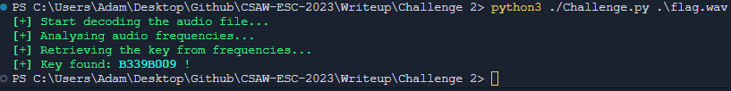

# Bluebox Challenge Solution Script

```console
usage: Challenge.py [-h] [-d] file

Bluebox challenge solution script.

positional arguments:
  file         .WAV file you want to analyze

options:
  -h, --help   show this help message and exit
  -d, --debug  show graphs to debug
```

### Example :

Use `-d` to display frequency analysis diagram (need to close it to continue the analysis). 

```console
python3 ./Challenge.py flag.wav
```

### Expected output :

##### Expected output of the analysis : 


##### Expected output of the UART console : 
