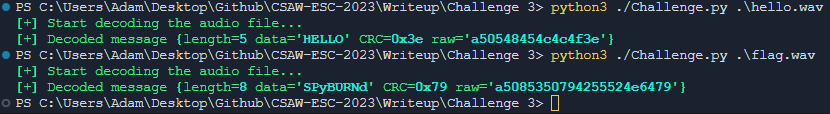

# SPItFire Challenge Solution Script

```console
usage: Challenge.py [-h] [-d] file

SPItFire challenge solution script.

positional arguments:
  file         .WAV file you want to analyze

options:
  -h, --help   show this help message and exit
  -d, --debug  Display plot of the data (need to close it to continue the decode).
```

### Example for the "HELLO" message :

Use `-d` to display plot of the data (need to close it to continue the decode).

```console
python3 ./Challenge.py hello.wav
```

### Example for the flag :

Use `-d` to display plot of the data (need to close it to continue the decode).

```console
python3 ./Challenge.py flag.wav
```

### Expected output :

##### Expected output of the analysis : 

