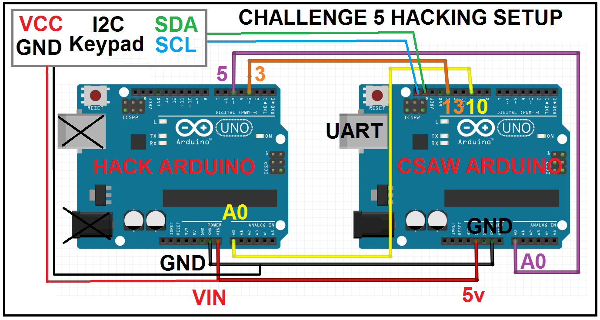
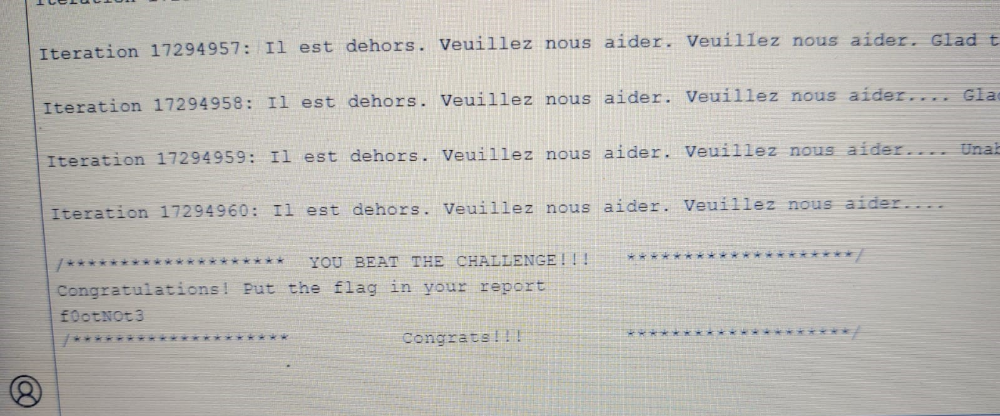

# Sock and Roll Instructions Solution

1. **Connect the "Hack" Arduino as following**



2. **Flash the "Hack" Arduino with firmware**

```console
C:\Users\User\AppData\Local\Arduino15\packages\arduino\tools\avrdude\6.3.0-arduino17\bin\avrdude -C C:\Users\User\AppData\Local\Arduino15\packages\arduino\tools\avrdude\6.3.0-arduino17/etc/avrdude.conf -v -V -patmega328p -carduino -P COM3 -b115200 -D -Uflash:w:<you_path>Challenge.hex:i
```

3. **Start the 2 Arduino boards at the same time**

### Expected output :

