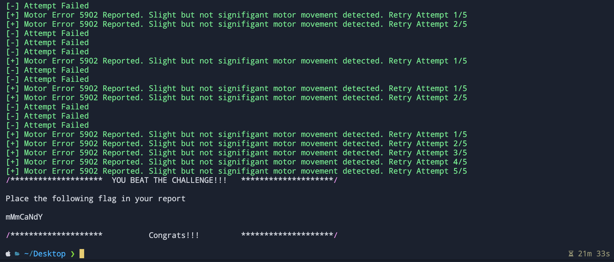

# VenderBender Challenge Solution Script

```console
usage: Challenge.py [-h] -i INTERFACE -b BAUDRATE

VenderBender challenge solution script.

options:
  -h, --help            show this help message and exit
  -i INTERFACE, --interface INTERFACE
                        UART inteface of the Arduino board.
  -b BAUDRATE, --baudrate BAUDRATE
                        Baudrate of the UART port of the Arduino board.
```

### Example :

```console
python3 ./Challenge.py -i COM3 -b 115200
```

### Expected output :

